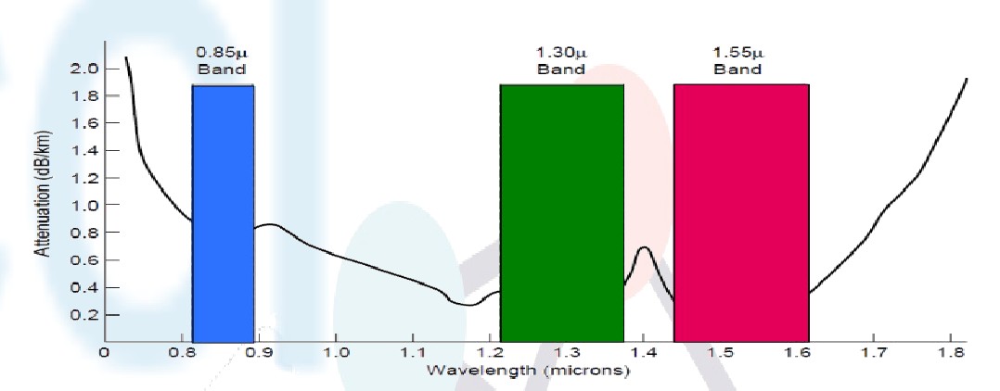

# 1. The left-hand bar is narrower. Why?

Because at that frequency, the attenuation line hits a little valley. To the left of the bar, there is a big spike in attenuation, and to the right, a little hill. That small 0.85μ band represents a frequency where the frequency does not experiment much attenuation.

# 2. Television channels are 6 MHz wide. How many bits/sec can be sent if four-level digital signals are used? Assume a noiseless channel.

$B=6\text{MHz},V=4\implies \text{Maximum Data Rate}=2\times 6\text{MHz}\times \log_{2}(4)\text{bps}=12\text{MHz}\times 2\text{bps}=24\text{Mbps}$

# 3. If a binary signal is sent over a 3-kHz channel whose signal-to-noise ratio is 20 dB, what is the maximum achievable data rate?

$B=3\text{KHz}, \frac{S}{N}=20\text{dB}\implies \text{Maximum Data Rate}=3\text{KHz}\times \log_{2}(21)\text{bps}\approx 13.18\text{Kbps}$

# 4. In a typical mobile phone system with hexagonal cells, it is forbidden to reuse a frequency band in an adjacent cell. If 840 frequencies are available, how many can be used in a given cell?

838.

Assume cell $C$ has neighbors $N_{i};i=[0,5]$, and each neighbor $N_{i}$ uses a frequency of one of the 840. Among them, they must be distinct between neighbors. If each neighbor uses a frequency that their immediate neighbor does not, but their next neighbor does, then that means that $\forall\ i\text{ odd}$, $N_{i}$ uses frequency $x$, while $\forall\ i\text{ even}$, $N_{i}$ uses frequency $y$ such that

| Neighbor | Frequency |
| -------- | --------- |
| $N_{0}$  | $x$       |
| $N_{1}$  | $y$       |
| $N_{2}$  | $x$       |
| $N_{3}$  | $y$       |
| $N_{4}$  | $x$       |
| $N_{5}$  | $y$       |
Then, of the set $F$ of 840 frequencies, cell $C$ may use all frequencies in the subset $F-\{x,y\}$.

# 5. Make a rough estimate of the number of PCS microcells 100 m in diameter it would take to cover San José (45 square km).

About seven thousand.

$45km^2=45,000,000m^2$. If a cell has $100m$ in diameter, and the cell is hexagonal, its circumradius is $50m$, which means its area is $A=\frac{3\sqrt{ 3 }}{2} 50^2\approx 6495m^2$. Thus, $\frac{45,000,000}{6495}\approx 6928$.
